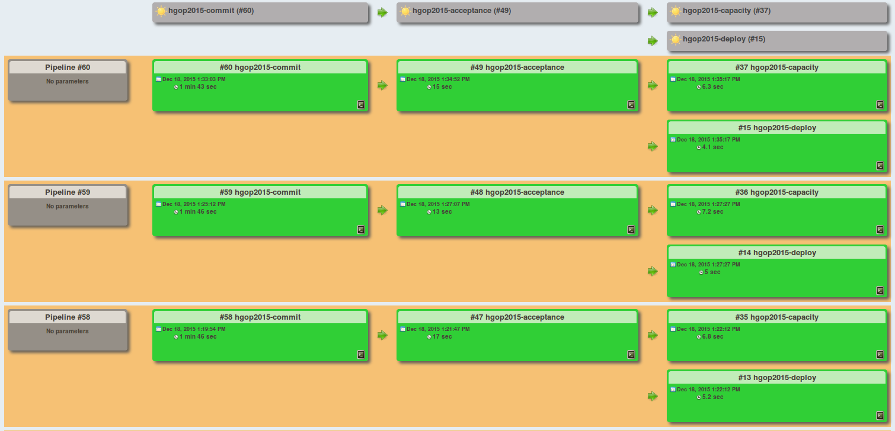

TicTacToe - Skýrsla
===================
Í þessu skjali verður farið yfir hluti sem tengjast þróunn leikjarins.

# Tól
## Vagrant
Vagrant er notað til að búa til og stilla þróunar umhverfi, í þessu verkefni sér það um að sýndarvélarnar sé allar eins settar upp. Þetta sér um að kerfið geti alltaf keyrt á því umhverfi sem á að gefa það út á ekkert meira "works on my machine".
## Virtualbox
Virtualbox er notað til að búa til og keyra sýndarvélar, í þessu verkefni er virtualbox notað af vagrant til að keyra sýndarvélarnar.
## Grunt
Grunt er notað til þess að sjálfvirknivæða hluti til þess að það ekki þurfi að gera þá handvirkt, í þessu verkefni er grunt notað til að sjálfvirknivæða ýmsa hluti eins og prófanir og þjöppun.
## Npm
Npm auðveldar manni að halda utan um og að ná í node.js pakka. Þetta er notað til þess að auðvelt sé að ná í pakka sem þarf til að forritið keyri, einnig er þetta mjög góð skjölun þar sem hægt er að sjá lista af nodejs pökkum sem þarf til þess að kerfið keyri.
## NodeJS
NodeJS er keyrslu umhverfi sem virkar á milli kerfa til að þróa net forrit, í þessu verkefni notum við nodejs til þess að þróa tictactoe leik.
## Bower
Bower heldur utan um pakka fyrir framenda og gerir það auðvelt að stjórna útgáfu og sækja pakka, í þessu verkefni er bower notað til þess að halda utan um hvaða pakkar eru notaðir í leiknum og gera það auðvelt að installa þeim. Eins og npm er bower gott til að halda utan um alla pakka sem kerfið notar.
## Docker
Docker er notað til að byggja hugbúnað, í þessu verkefni erum við að nota það til þess að geyma "myndirnar" sem verða til þegar kerfið er þýtt. Þetta er gott til þess að halda utan um allar útgáfur af kerfinu og passa uppá að "myndin" sem var byggð sé bara þýdd einu sinni og alltaf sé notuð sama "myndin".

# Deployment Path
Here we talk about the things that happen when deploying the game.
## Pipeline
After a change has been pushed into version control the code goes through a series of stages before it can be deployed to production.
It is worth noting that the stages that are triggered by the commit stage are loading the git revision hash from the artifact repository plugin.
### Stage 1 - commit
The first stage of the pipeline is the commit stage, this is were we install dependencies necessary for compilation, run unit tests and create a binary that can be deployed. Additionally we are using an artifact plugin that stores our git revision hash between stages.

Here are the script that are run by our Jenkins CI server in the commit stage:

jenkins-commit.sh
``` shell
#!/bin/bash

echo 'Starting jenkins shell script'

export PATH=/usr/local/bin:$PATH;
export DISPLAY=:0

npm install
npmexitcode=$?
if [ $npmexitcode != 0 ]; then
  echo "npm install exited with error code $npmexitcode"
  exit $npmexitcode
fi

bower install
bowerexitcode=$?
if [ $bowerexitcode != 0 ]; then
  echo "bower install exited with error code $bowerexitcode"
  exit $bowerexitcode
fi

./bin/dockerbuild.sh
buildexitcode=$?
if [ $buildexitcode != 0 ]; then
  echo "Dockerbuild exited with error code $buildexitcode"
  exit $buildexitcode
fi

echo 'Finished jenkins shell script'

exit 0
```

dockerbuild.sh
``` shell
#!/bin/bash

echo Cleaning...
rm -rf ./dist


if [ -z "$GIT_COMMIT" ]; then
  export GIT_COMMIT=$(git rev-parse HEAD)
  export GIT_URL=$(git config --get remote.origin.url)
fi

export GITHUB_URL=$(echo $GIT_URL)

echo Building app
grunt
gruntexitcode=$?
if [ $gruntexitcode != 0 ]; then
    echo "grunt exited with error code $gruntexitcode"
    exit $gruntexitcode
fi

cat > ./dist/githash.txt <<_EOF_
$GIT_COMMIT
_EOF_

cat > ./dist/public/version.html << _EOF_
<!doctype html>
<head>
   <title>TicTacToe version information</title>
</head>
<body>
   <span>Origin:</span> <span>$GITHUB_URL</span>
   <span>Revision:</span> <span>$GIT_COMMIT</span>
   <p>
   <div><a href="$GITHUB_URL/commits/$GIT_COMMIT">History of current version</a></div>
</body>
_EOF_

cp ./Dockerfile ./dist/
mv 'TESTS-Firefox_38.0.0_(Linux_0.0.0).xml' ./dist/

cd dist
npm install --production
npmexitcode=$?
if [ $npmexitcode != 0 ]; then
    echo "npm install exited with error code $npmexitcode"
    exit $npmexitcode
fi

echo "Building docker image"
sudo service docker start
docker build -t ironpeak/tictactoe:$GIT_COMMIT .
buildexitcode=$?
if [ $buildexitcode != 0 ]; then
    echo "docker build exited with error code $buildexitcode"
    exit $buildexitcode
fi

echo "Pushing docker image"
docker push ironpeak/tictactoe:$GIT_COMMIT
pushexitcode=$?
if [ $pushexitcode != 0 ]; then
    echo "docker push exited with error code $pushexitcode"
    exit $pushexitcode
fi

echo "Done"

exit 0
```

### Stage 2 - acceptance
The second stage of the pipeline is the acceptance stage, this is were we deploy the binary from the previous stage on the the production test environment and runs acceptance tests on it.

Here are the script that are run by our Jenkins CI server in the acceptance stage:

jenkins-acceptance.sh
``` shell
#!/bin/bash

export PATH=/usr/local/bin:$PATH;
export DISPLAY=:0
export ACCEPTANCE_URL=192.168.50.4:8080
GIT_UPSTREAM_HASH=$(<dist/githash.txt)

npm install
npmexitcode=$?
if [ $npmexitcode != 0 ]; then
  echo "npm install exited with error code $npmexitcode"
  exit $npmexitcode
fi

bower install
bowerexitcode=$?
if [ $bowerexitcode != 0 ]; then
  echo "bower install exited with error code $bowerexitcode"
  exit $bowerexitcode
fi

./bin/dockerdeploy.sh $GIT_UPSTREAM_HASH 8080
deployexitcode=$?
if [ $deployexitcode != 0 ]; then
  echo "deploy exited with error code $deployexitcode"
  exit $deployexitcode
fi

grunt mochaTest:acceptance
acceptanceexitcode=$?
if [ $acceptanceexitcode != 0 ]; then
  echo "Acceptance tests exited with error code $acceptanceexitcode"
  exit $acceptanceexitcode
fi

exit 0
```

dockerdeploy.sh
``` shell
#!/bin/bash

echo "Running revision $1 on port $2"

echo -e '\nPulling from docker'
ssh vagrant@192.168.50.4 "docker pull ironpeak/tictactoe:$1"
pulldocker=$?
if [ $pulldocker != 0 ]; then
    echo "docker pull failed with error code $pulldocker"
    exit $pulldocker
fi

echo -e '\nKilling and removing current'
ssh vagrant@192.168.50.4 "(docker kill production$2; docker rm production$2;)"

echo -e '\nDeploying'
ssh vagrant@192.168.50.4 "docker run -p $2:8080 -d -e NODE_ENV=production --name production$2 ironpeak/tictactoe:$1"
rundocker=$?
if [ $rundocker != 0 ]; then
    echo "docker run failed with error code $rundocker"
    exit $rundocker
fi

echo -e '\nDone'

exit 0
```
If jenkins-acceptance.sh exits with an error code the stage fails the following stages are not triggered.

### Stage 3 - capacity
The third stage of the pipeline is the capacity stage which runs in parallel of the deploy stage, this is were we run capacity tests on the server that was deployed in the previous stage.

Here are the script that are run by our Jenkins CI server in the capacity stage:

jenkins-capacity.sh
``` shell
#!/bin/bash

export DISPLAY=:0
export PATH=/usr/local/bin:$PATH;
export ACCEPTANCE_URL=192.168.50.4:8080

npm install
npmexitcode=$?
if [ $npmexitcode != 0 ]; then
  echo "npm install exited with error code $npmexitcode"
  exit $npmexitcode
fi

bower install
bowerexitcode=$?
if [ $bowerexitcode != 0 ]; then
  echo "bower install exited with error code $bowerexitcode"
  exit $bowerexitcode
fi

grunt mochaTest:load
capacityexitcode=$?
if [ $capacityexitcode != 0 ]; then
  echo "Capacity tests exited with error code $capacityexitcode"
  exit $capacityexitcode
fi

exit 0
```

If you want to know more about the capacity tests, read the next chapter.

### Stage 3 - deploy
The third stage of the pipeline is the deploy stage which runs in parallel of the capacity stage, this is were we deploy the binary into our production environment.

Here are the script that are run by our Jenkins CI server in the deploy stage:

jenkins-deploy.sh
``` shell
#!/bin/bash

GIT_UPSTREAM_HASH=$(<dist/githash.txt)

echo "Starting jenkins deploy script"

./bin/dockerdeploy.sh $GIT_UPSTREAM_HASH 9090
deployexitcode=$?
if [ $deployexitcode != 0 ]; then
  echo "deploy exited with error code $deployexitcode"
  exit $deployexitcode
fi

echo "jenkins deploy script finished"

exit 0
```

# Load Tests
After a successful acceptance stage, the capacity stage is triggered. At first I created a load test that played a 1000 games to a draw, but that test took 80-120 seconds to run so I reduced the number of games to 100 which resulted in the test taking about 4-5 seconds. The test is set to timeout (fail) if the time it takes to run exceeds 8 seconds.

NodeJS uses asynchronous IO so I had to recreate the fluid api to make sure that each individual test wouldn't be executing commands in parallel, this is something that I should have been doing from the beginning and the previous implementation was a result of my lack of knowledge and experience with NodeJS. In order to make sure that commands for a given test are run serially I made the commands execute recursively so the next command wouldn't be sent until the previous one had finished executing and the request for the game history wouldn't be sent until after every command for the test had finished.

As a result each of the 100 individual games being played in the load test is executing serially but the games are running in parallel of each other, that is Game 1 is not necessary finished before Game 2 is started as it would be if test games were running serially.

# Traceability
What does this give us? Who would use the capability to track versions and why? Who would use capability to deploy any version and why?

* This gives us the ability to track which revision resulted in a given binary and it's history.
* The people who are in charge of deploying the system (operations staff) can pick a version they know it is the same one (because revision hashes are unique).
* Easy to rollback to another version if something goes wrong.

What was wrong with having docker push in the deployment script rather than in the dockerbuild.sh script?

* Pushing a docker image should only be done once (otherwise you are just wasting time), building an images is also an operation that should only be done once so it makes sense to have them together.
* Deploying a given image is something that is often done more than once.
* Can result in another image being pushed to docker (if another image has been built in the mean time it could be pushed to docker under the wrong revision number).

How does the "deploy any version, anywhere" build feature work? Hint: Track GIT_COMMIT

* When a revision (change set) is committed to git it is hashed (given a unique identifier), so when we push an image to docker we tag it with the hash from the git commit so that each image has a connection with some git commit.
* If we want to deploy some git revision we simply take the hash and pull the docker image associated with it. So we are using same binary that was created and tested with that revision.

# Jenkins
## Shell scripts
### Commit Stage
``` shell
./bin/jenkins-commit.sh
exit $?
```
[jenkins-commit.sh](../bin/jenkins-commit.sh)

### Acceptance Stage
``` shell
./bin/jenkins-acceptance.sh
exit $?
```
[jenkins-acceptance.sh](../bin/jenkins-acceptance.sh)

### Capacity Stage
``` shell
./bin/jenkins-capacity.sh
exit $?
```
[jenkins-capacity.sh](../bin/jenkins-capacity.sh)

### Deploy Stage
``` shell
./bin/jenkins-deploy.sh
exit $?
```
[jenkins-deploy.sh](../bin/jenkins-deploy.sh)

## Plugins
* GitHub Plugins
* Build Pipeline Plugin
* Copy Artifact Plugin

## Pipeline

